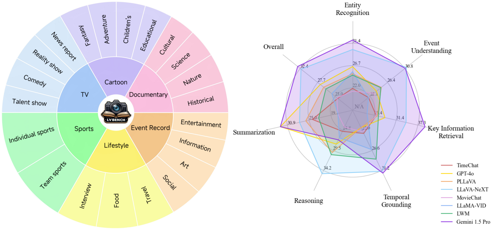
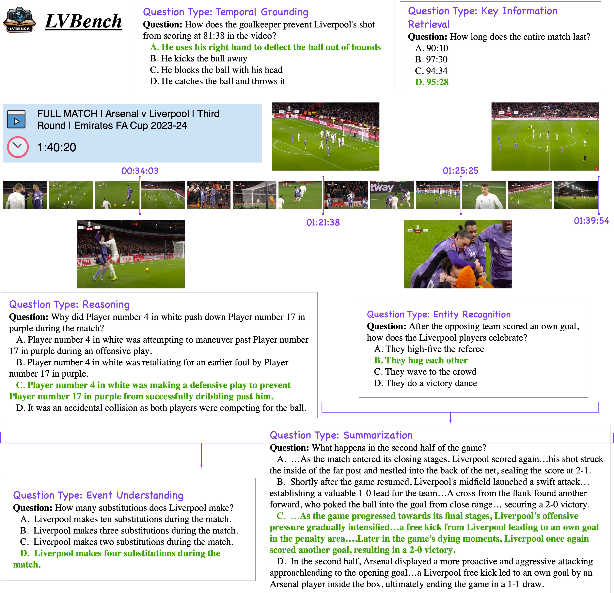
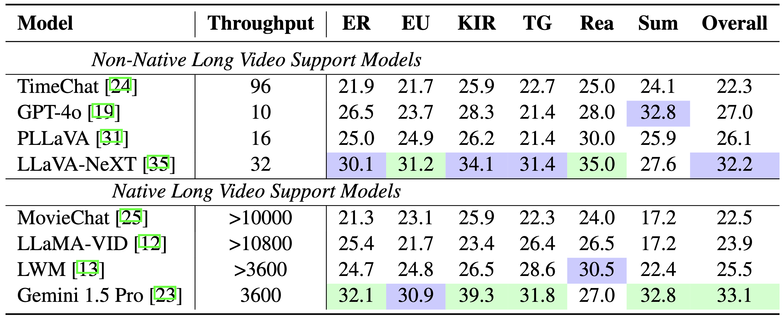
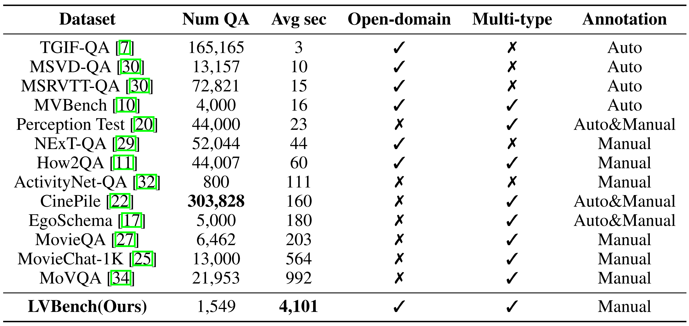
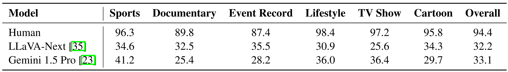
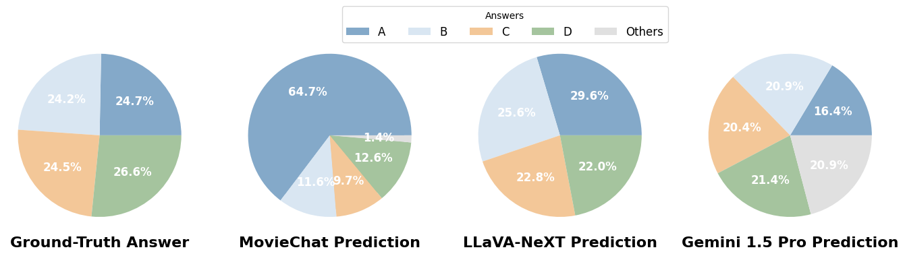

# LVBench: An Extreme Long Video Understanding Benchmark

 
 
  


<font size=7><div align='center' > [[🍎 Project Page](https://lvbench.github.io/)] [[📖 arXiv Paper](https://arxiv.org/abs/2406.08035)] [[📊 Dataset](https://huggingface.co/datasets/THUDM/LVBench)][[🏆 Leaderboard](https://lvbench.github.io/#leaderboard)]  </div></font>

<p align="center">
    
</p>


LVBench is a benchmark designed to evaluate and enhance the capabilities of multimodal models in understanding and extracting information from long videos up to two hours in duration.


---

## 🔥 News
* **`2024.06.11`** 🌟 We released LVBench, a new benchmark for long video understanding!

## 👀 Introduce to LVBench

LVBench is a benchmark designed to evaluate the capabilities of models in understanding long videos. We collected extensive long video data from public sources, annotated through a mix of manual effort and model assistance. Our benchmark provides a robust foundation for testing models on extended temporal contexts, ensuring high-quality assessment through meticulous human annotation and multi-stage quality control.


### Features

1. **Core Capabilities**: Six core capabilities for long video understanding, enabling the creation of complex and challenging questions for comprehensive model evaluation.
2. **Diverse Data**: A diverse range of long video data, averaging five times longer than the longest existing datasets, covering various categories.
3. **High-Quality Annotations**: Reliable benchmark with meticulous human annotation and multi-stage quality control processes.



## Dataset

### License
Our dataset is under the CC-BY-NC-SA-4.0 license.

LVBench is only used for academic research. Commercial use in any form is prohibited. We do not own the copyright of any raw video files. 

If there is any infringement in LVBench, please contact shiyu.huang@aminer.cn or directly raise an issue, and we will remove it immediately.


### Download

Install video2dataset first:
```shell
pip install video2dataset
pip uninstall transformer-engine
```

Then you should download `video_info.meta.jsonl` from [Huggingface](https://huggingface.co/datasets/THUDM/LVBench) and put it in the `data` directory.

Each entry in the `video_info.meta.jsonl` file has a key field corresponding to a YouTube video's ID. Users can download the corresponding video using this ID. Alternatively, users can use the download script we provide, download.sh, for downloading:
```shell
cd scripts
bash download.sh
```

After the execution, the video files will be stored in the `script/videos` directory.

## Install LVBench
```shell
pip install -e .
```


## Get Evaluation Results

(Note: if you want to try the evaluation quickly, you can use the `scripts/construct_random_answers.py` to prepare a random answer file.)

```shell
cd scripts
python test_acc.py
```

## 📈 Results

- **Model Comparision:**

<p align="center">
    
</p>

- **Benchmark Comparison:**

<p align="center">
    
</p>

- **Model vs Human:**

<p align="center">
    
</p>

- **Answer Distribution:**

<p align="center">
    
</p>

## :black_nib: Citation

If you find our work helpful for your research, please consider citing our work.   

```bibtex
@misc{wang2024lvbench,
      title={LVBench: An Extreme Long Video Understanding Benchmark}, 
      author={Weihan Wang and Zehai He and Wenyi Hong and Yean Cheng and Xiaohan Zhang and Ji Qi and Shiyu Huang and Bin Xu and Yuxiao Dong and Ming Ding and Jie Tang},
      year={2024},
      eprint={2406.08035},
      archivePrefix={arXiv},
      primaryClass={cs.CV}
}
```
